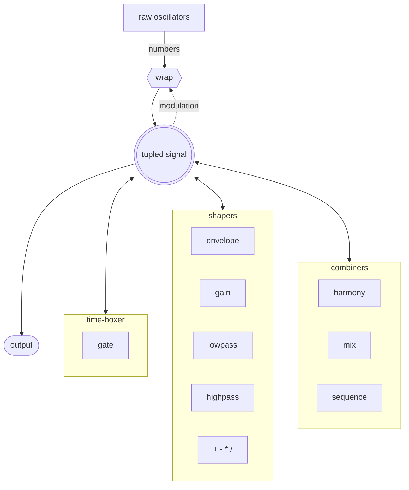
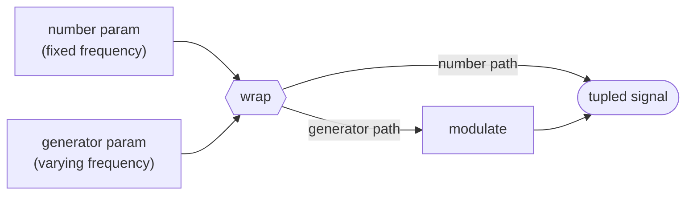
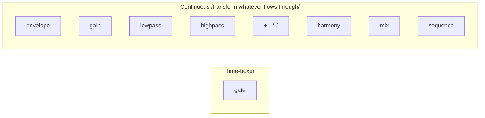
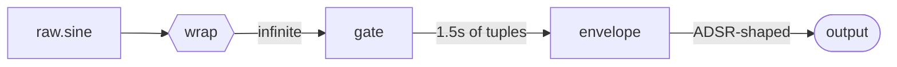
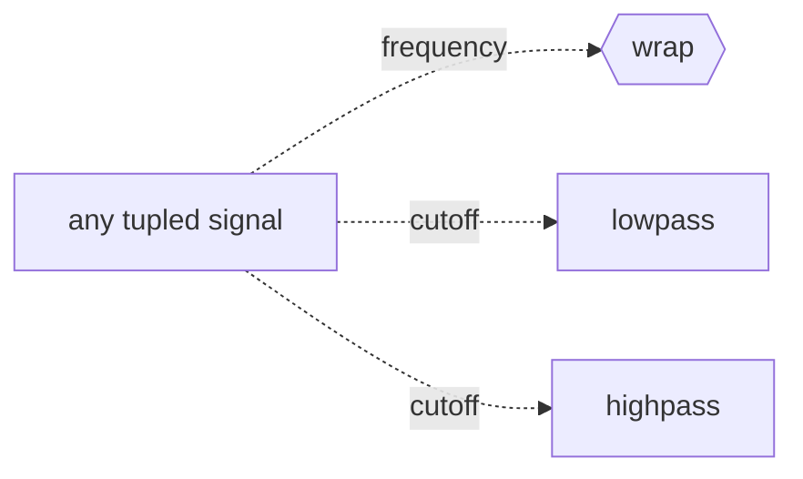

# On the engine

This document explains the architecture of the Lyre synth engine - what the primitives are, how they connect, and how signals flow through the system.

## Two worlds

The engine is split into two layers separated by a single bridge function. Everything in Lyre lives in one of these:

- **Raw world** - generators that yield plain numbers, one per sample
- **Tupled world** - generators that yield `[sample, n, totalSamples]` tuples

The raw world is small - just five oscillators. The tupled world is everything else: shapers, filters, combinators, arithmetic. The bridge between them is `wrap`.



The middle node /the circled `tupled signal`/ is a **type**, not a function. Every category around it both reads from and writes to that type - the bidirectional arrows say so. This means `harmony` can take the output of `envelope` or `gain` or another `harmony`, and so can every other function. The categories are just stylistic groupings - composability comes from sharing the type. The dashed line is modulation feedback - any tupled signal can loop back to `wrap` as a frequency input for vibrato or FM.

## The raw world

Five oscillators live under the `raw` namespace. They take a number and yield numbers forever:

- `raw.sine` - smooth sine wave
- `raw.sawtooth` - rising ramp, all harmonics, bright and buzzy
- `raw.square` - hollow, only odd harmonics, clarinet-like
- `raw.triangle` - softer, odd harmonics with sharper rolloff than square
- `raw.flat` - constant value forever /not really an oscillator, but lives in raw for uniformity/

Raw oscillators are stateless to the user - you give them a frequency, they yield numbers. The Lyre prelude never exposes them directly. They always go through `wrap` first.

## The bridge - wrap

`wrap` lifts a raw oscillator into the tupled world. Its behavior depends on what you pass as the second argument:



When the parameter is a number, `wrap` calls the raw oscillator and lifts each yielded sample into a tuple. When the parameter is a generator, `wrap` delegates to `modulate`, which reads a fresh frequency from the generator each sample and recomputes phase increment.

This is what makes vibrato possible. `(sine (+ 440 (* 10 (sine 5))))` evaluates the inner expression to a generator yielding values around 440. `wrap` sees a generator, dispatches to `modulate`, and produces a 440 Hz sine that wobbles ±10 Hz at 5 Hz.

## The tupled world

Once a signal is tupled, it can flow through any combination of these functions and back into any of them. The key categories:

### Time-boxer

Only one primitive turns infinite signals into finite ones:

- `gate(duration, source)` - yields samples for `duration` seconds, then stops

That's the only way to set a duration. Everything else is duration-agnostic.

### Shapers

Take a tupled source and yield a transformed tupled signal of the same length:

- `envelope(A, D, S, R, source)` - applies an ADSR amplitude curve. Reads the duration from the source's `totalSamples`. For infinite sources, the release never fires - sustain holds forever.
- `gain(source, level)` - multiplies every sample by `level`
- `lowpass(source, cutoff)` - first-order low-pass filter. Cutoff can be a number or a tupled generator for filter sweeps and wobbles.
- `highpass(source, cutoff)` - first-order high-pass filter. Same cutoff rules.
- `+ - * /` - sample-by-sample arithmetic. Each operand can be a number or a tupled generator. Used for tremolo, ring modulation, signal arithmetic.

### Combinators

Variadic - take multiple tupled sources and combine them:

- `sequence(sources...)` - plays each source one after another
- `harmony(sources...)` - sums samples in parallel without normalization
- `mix(sources...)` - sums and divides by voice count to prevent clipping

### Time-boxers vs continuous



There's exactly one primitive that creates a finite output from an infinite input: `gate`. Everything else preserves the duration of what flows through it. This is the rule that makes composition simple - you set the duration once with `gate`, and the rest of the pipeline just shapes whatever's inside.

`wrap` is also technically a time-boxer in its modulated path - if you feed it a finite frequency generator, the resulting oscillator stops when the modulator stops.

## Composing a pluck

The canonical example: a plucked string sound.



Three steps, three concerns:

1. **Generate** - `raw.sine` produces samples
2. **Time-box** - `gate` decides the note lasts 1.5 seconds
3. **Shape** - `envelope` applies the ADSR curve over those 1.5 seconds

In Lyre:

```lisp
(envelope 0.01 0.4 0 0.5
  (gate 1.5 (sine 440)))
```

In JS:

```js
envelope(
  0.01, 0.4, 0, 0.5,
  gate(1.5, wrap(raw.sine, 440))
)
```

Each primitive does one thing. The composition tells the story.

## Modulation

The modulation path is what makes the engine more than a fixed pipeline. Any tupled signal can be used as a parameter for another tupled signal that accepts modulation. Three places this happens:



- **`wrap.param`** - frequency modulation /vibrato, FM, pitch envelopes/
- **`lowpass.cutoff`** and **`highpass.cutoff`** - filter modulation /sweeps, wah-wah/
- **arithmetic operands** - any signal can be added to or multiplied by another /tremolo, ring mod, control signal scaling/

A typical modulation pattern uses `envelope` to shape a control signal, scales it with arithmetic, and feeds it to the modulation point:

```lisp
; Brightness sweep - cutoff goes from 3000 Hz to 500 Hz over 1 second
(lowpass
  (+ 500 (* 2500 (envelope 0 0 1 1.0 (gate 1.0 (flat 1)))))
  (gate 1.0 (sawtooth 220)))
```

The inner `envelope` receives a constant `flat 1` source, gates it for 1 second, and applies an ADSR shape. The output is a curve from 0 to 1. Multiply by 2500 to get 0 to 2500. Add 500 to get 500 to 3000. Feed that into `lowpass` as the cutoff, and the filter sweeps over time.

## What's NOT in the engine

A few things are deliberately absent:

- **No `repeat`** - exists in JS but not exposed in Lyre. Use `sequence` with the same expression multiple times.
- **No band-pass or notch filter** - compose them: band-pass = highpass inside lowpass; notch = mix of lowpass and highpass.
- **No multi-pole filter primitives** - nest `lowpass` calls for steeper slopes /each layer adds 6 dB/octave/.
- **No `filterEnvelope`** - use `lowpass` with a generator cutoff built from `envelope` and arithmetic.
- **No `ASR` envelope as a separate curve** - envelope wraps a source. To use the curve as a modulation signal, wrap a `flat 1` source.

The principle is one way to do one thing. Composition replaces convenience primitives.

## Reference

### Raw world

| Function | Input | Output |
|---|---|---|
| `raw.sine(freq)` | number | numbers |
| `raw.sawtooth(freq)` | number | numbers |
| `raw.square(freq)` | number | numbers |
| `raw.triangle(freq)` | number | numbers |
| `raw.flat(value)` | number | numbers |

### Bridge

| Function | Inputs | Output |
|---|---|---|
| `wrap(rawFn, param)` | raw fn, number OR tupled generator | tupled |
| `modulate(atPhase, freqGen)` | phase formula, tupled generator | tupled |

### Tupled world

| Function | Inputs | Output | Notes |
|---|---|---|---|
| `gate(duration, source)` | number, tupled | tupled | Only time-boxer |
| `envelope(A, D, S, R, source)` | 4 numbers, tupled | tupled | Reads totalSamples from source |
| `gain(source, level)` | tupled, number | tupled |  |
| `lowpass(source, cutoff)` | tupled, number OR tupled | tupled | Cutoff can be modulated |
| `highpass(source, cutoff)` | tupled, number OR tupled | tupled | Cutoff can be modulated |
| `harmony(...sources)` | variadic tupled | tupled | Sums without normalization |
| `mix(...sources)` | variadic tupled | tupled | Sums normalized by voice count |
| `sequence(...sources)` | variadic tupled | tupled | One after another |
| `+ - * /` | 2 args, each number OR tupled | number OR tupled | Sample-by-sample when generators |

### Lyre prelude additions

The prelude wraps these JS functions and adds:

- **Note frequencies** - `C1` through `G6` with sharps and flats
- **Defaults** - `.` /tick duration/, `attack`, `decay`, `sustain`, `release`, `wave`
- **`sine`, `sawtooth`, `square`, `triangle`, `flat`** - convenience for `wrap(raw.X, ...)`
- **`play`** - convenience for `(envelope ... (gate (...) (wave ...)))` using prelude defaults
- **`let`** - special form for local bindings
