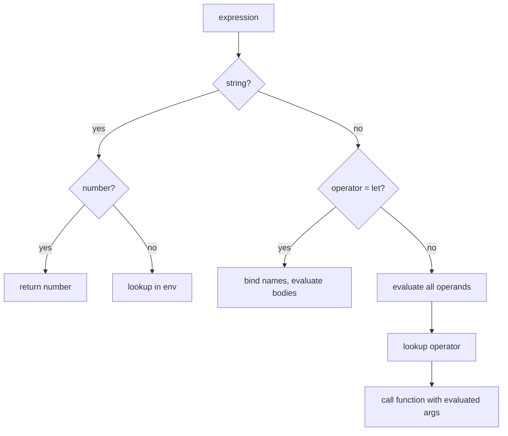
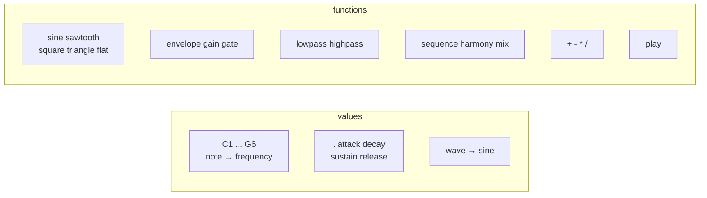

# On the language

This document explains the Lyre language - its syntax, evaluation model, syntactic sugar, and what it could become.

## A minimal Lisp

Lyre is a Lisp-1. One namespace, one evaluation rule, one special form. Everything else is a function looked up in the prelude.

```
(operator arg1 arg2 ...)
```

Parentheses group. The first position names the operation. The rest are arguments. Nested expressions are evaluated before the outer one. Numbers are numbers. Names resolve to values - a frequency, a function, a default parameter.

That's the whole syntax. Comments start with `;` and run to end of line.

## Evaluation



The evaluator is twelve lines of code. It handles two cases:

**Strings** - try to parse as a number. If that works, return it. Otherwise look it up in the environment. This is how `A4` becomes `440` and `sine` becomes a function.

**Arrays** - the first element is the operator, the rest are operands. If the operator is `let`, it's a special form /bind names, evaluate bodies/. Otherwise: evaluate all operands first, look up the operator, call it with the results.

There are no macros, no lazy evaluation, no short-circuiting. Every argument is fully evaluated before the function sees it. This is as simple as an evaluator gets.

## The prelude

The prelude is a flat list of `[name, value]` pairs. Functions are values - looked up the same way notes are. This is the Lisp-1 property: `sine` lives in the same namespace as `A4`.



Every name resolves through the same lookup. User bindings from `let` shadow prelude entries - lookup searches backwards from the most recent binding.

### Functions take arrays

Prelude functions receive `(args, env)` - the evaluated arguments as an array, and the current environment. This means any function can be variadic:

```lisp
(envelope 0.01 0.1 0.7 0.2    ; ADSR params
  (gate 0.5 (sine C4))        ; one source
  (gate 0.5 (sine E4))        ; another source
  (gate 0.5 (sine G4)))       ; and another
```

`envelope` peels off four numbers and treats the rest as sources, enveloping each and sequencing the results. `lowpass` and `highpass` work the same way - one cutoff, any number of sources.

### `play` and the defaults

`play` is the convenience function. It reads the current environment for `wave`, `.` /tick duration/, `attack`, `decay`, `sustain`, `release`, assembles a `gate` + `envelope` + waveform, and returns a generator.

```lisp
(play 2 A4)
```

is equivalent to:

```lisp
(envelope 0.005 0 1 0.005
  (gate 1.01 (sine 440)))
```

The `1.01` comes from: `attack + decay + ticks * . + release` = `0.005 + 0 + 2 * 0.5 + 0.005`.

Override any default with `let`:

```lisp
(let (wave triangle . 0.25 attack 0.01 release 0.1)
  (play 2 A4))
```

Now `play` uses `triangle` instead of `sine`, quarter-second ticks, and different ADSR.

## Syntactic sugar

Three sugar forms exist. They're expanded by `desugar` before evaluation.

### Sequence and mix prefixes

```lisp
-(expr1 expr2 ...)   →   (sequence expr1 expr2 ...)
=(expr1 expr2 ...)   →   (mix expr1 expr2 ...)
```

The `-` and `=` only trigger as sugar when they appear before a parenthesized group. Inside an expression like `(- a b)`, they remain arithmetic operators. The desugar pass protects operator position - only arguments get sugar-expanded.

### Dot notation

```lisp
.C4      →   (play 1 C4)       ; one tick
:G4      →   (play 2 G4)       ; two ticks
.:A4     →   (play 3 A4)       ; three ticks
C4.      →   (play 0.5 C4)     ; half tick /suffix divides/
C4:      →   (play 0.25 C4)    ; quarter tick
```

Prefix dots and colons multiply tick count. Suffix dots and colons divide. Each `.` = 1, each `:` = 2. The formula is `prefixSum / suffixSum`.

### Bar separator

`|` is whitespace. It does nothing but helps visually:

```lisp
-(.C4 .C4 .G4 .G4 | .A4 .A4 :G4
  .F4 .F4 .E4 .E4 | .D4 .D4 :C4)
```

### Rests

`(play N 0)` or `.0` produces silence. Frequency 0 means the oscillator generates nothing, and the envelope runs for the specified ticks. Useful for rhythmic gaps:

```lisp
-(play 0.5 0)       ; half-tick rest
-(.C4 .0 .E4 .0)   ; notes with rests between
```

## `let` - the only special form

`let` binds names to values in a new scope:

```lisp
(let (name1 value1 name2 value2 ...)
  body1 body2 ...)
```

Bindings are sequential - later bindings can reference earlier ones. Multiple bodies are sequenced. The bound names shadow anything in the enclosing scope.

```lisp
(let (root 220 fifth (* root 1.5))
  =(
    (envelope 0.01 1.0 0 0.5 (gate 1.51 (sine root)))
    (envelope 0.01 1.0 0 0.5 (gate 1.51 (sine fifth)))))
```

`let` is the only form the evaluator handles specially. Everything else - `envelope`, `gate`, `play`, `sine` - goes through the same evaluate-then-call path.

## What the tokenizer does

The tokenizer is a single-pass character scanner. It builds nested arrays from parentheses, splits on whitespace/pipes, strips comments, and hands the result to `desugar`.

```
"(sine A4)"  →  tokenize  →  [["sine", "A4"]]
                                    ↓
                              desugar  →  [["sine", "A4"]]  (no sugar here)

".C4 .E4"   →  tokenize  →  [".C4", ".E4"]
                                    ↓
                              desugar  →  [["play", "1", "C4"], ["play", "1", "E4"]]
```

Top-level expressions are returned as an array. Multiple top-level expressions are played in sequence by the runner.

## What Lyre does NOT have

- **No `define`** - there are no top-level bindings. Use `let` for local scope.
- **No lambdas** - functions can't be created at runtime. They come from the prelude.
- **No conditionals** - no `if`, no branching. Every expression produces sound.
- **No `repeat`** - exists in JS but isn't exposed. Write the phrase out or use `let` to name it and reference it multiple times /though that requires multiple evaluation, which currently re-evaluates/.
- **No imports** - one file, one piece.
- **No strings** - every token is either a number or a name to look up.
- **No variables** - `let` creates bindings, not mutable state.

## What could come next

### Things that feel close

**`repeat`** - the JS primitive exists. Exposing it needs a way to pass a thunk /a generator factory/ rather than a generator, since generators are single-use. Possible syntax: `(repeat 4 (play 1 C4))` where the body is re-evaluated each time rather than pre-evaluated.

**Lambdas** - user-defined functions. `(fn (x) (sine x))` returning a callable that the evaluator treats like a prelude function. This unlocks abstraction - name a pattern once, apply it to different arguments. The evaluator already passes `env` to every function, so closures are one step away.

**`define`** - top-level bindings. `(define pluck (fn (note) (envelope 0.01 0.4 0 0.5 (gate 1.5 (sine note)))))` to name reusable patterns. Combined with lambdas, this turns Lyre into a real composition tool.

### Things that need design

**Conditionals** - `(if condition then else)`. What does a condition mean in a sound language? Could be useful for generative music - randomly choose between phrases, switch patterns based on beat count. But randomness and state are foreign to the current model.

**Pattern sequencing** - a way to express rhythmic patterns more compactly than listing every note. Something like `(pattern [C4 E4 G4] [1 1 2])` for pitches and durations. The dot notation already does this for simple cases, but complex rhythms are verbose.

**Multi-file composition** - `(include "drums.lyre")` to split large pieces across files. The runner already reads files; making the language aware of them is the question.

**Live evaluation** - a REPL that evaluates expressions and sends them to the audio output in real time. The generator architecture supports this naturally - each expression yields samples that can be streamed as they're produced.

**Polyphonic `play`** - `play` currently produces one voice. A chord shorthand like `(play 2 C4 E4 G4)` that mixes multiple notes with the same envelope could simplify harmonic writing.

### Things worth thinking about

**Are rests satisfying?** - `.0` works but reads as "play zero hertz." A dedicated rest symbol /`_` or `r`/ would be clearer and wouldn't need the oscillator machinery.

**Should `let` bindings be lazy?** - currently `(let (x (sine 440)) =(x x))` doesn't work as expected because `x` is evaluated once, producing a single generator that gets exhausted. Lazy bindings would re-evaluate each reference, making named reuse natural. But laziness changes the mental model significantly.

**Where does timbre live?** - right now, timbre is built from scratch each time: choose a waveform, add harmonics, filter, modulate. A timbre abstraction /a function from frequency to shaped generator/ would let `play` produce complex sounds without spelling out the synthesis chain every time. Lambdas would solve this.

**What about dynamics?** - velocity, accent, crescendo. Currently, every note from `play` has the same amplitude. Dynamics could be another prelude default like `velocity`, or a parameter to `play`.
